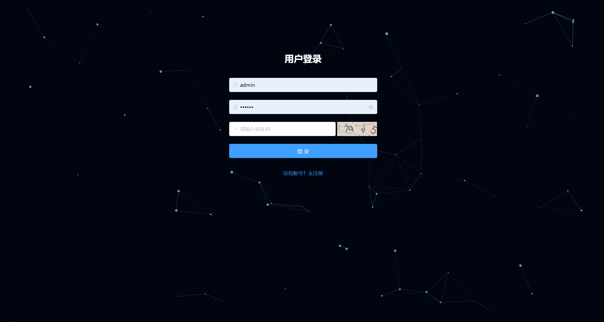
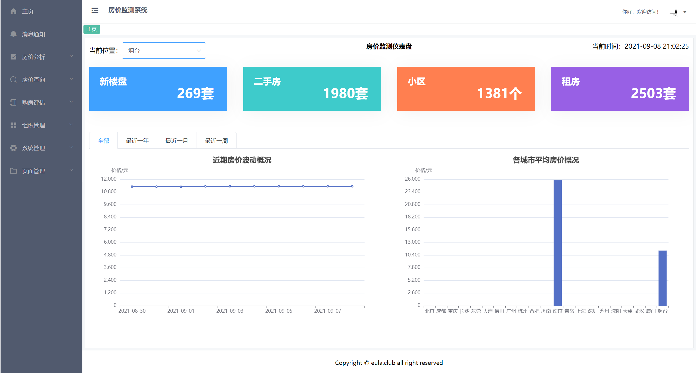
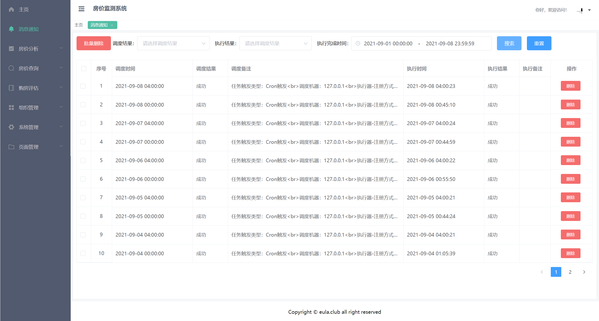
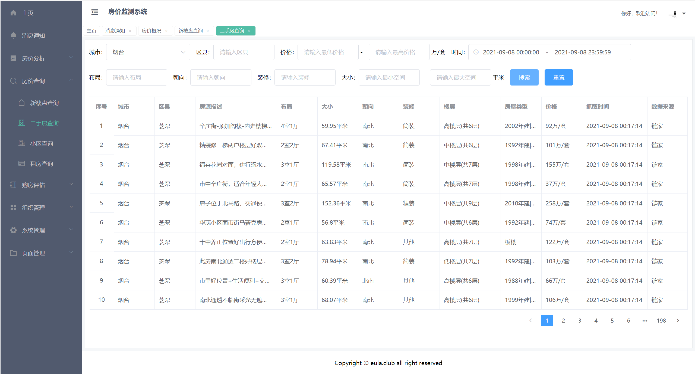
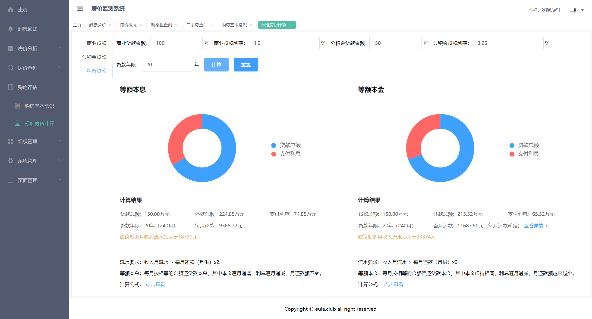
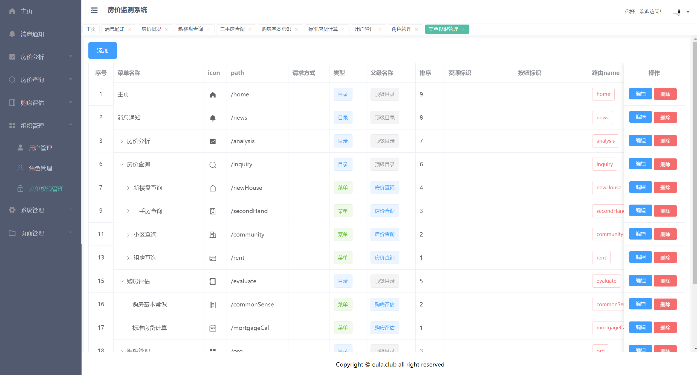
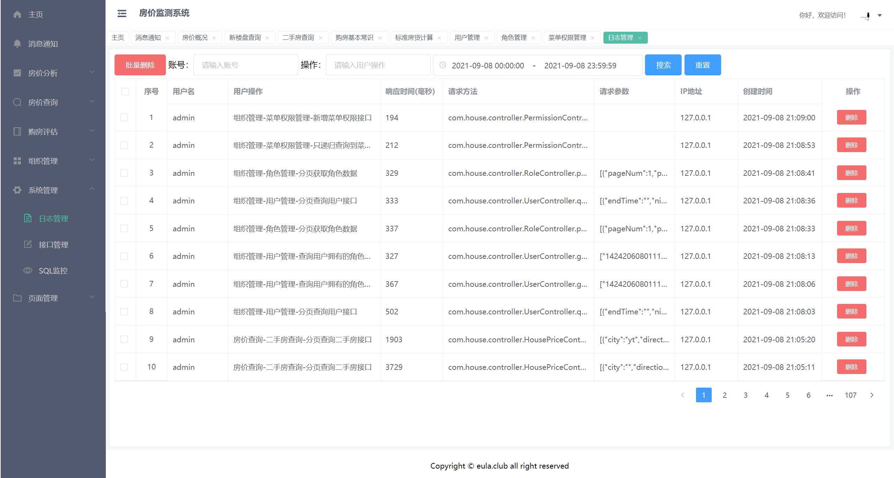
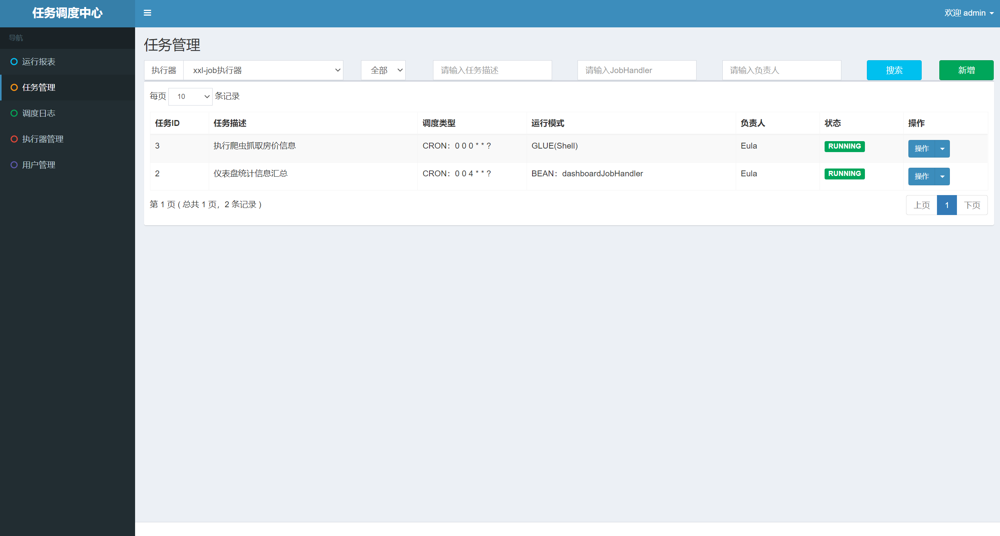

## 1. 项目简介

一个基于Springboot+Vue的房价可视化监测系统，数据抓取自链家，通过Echarts进行可视化展现。

项目地址：[https://github.com/Logistic98/house-price-monitor](https://github.com/Logistic98/house-price-monitor)

### 1.1 项目介绍

[1] 爬取链家的新楼盘、二手房、小区、租房信息作为分析数据，支持北上广深等国内21个主要城市。

[2] 通过 IP 代理池、伪装 User-Agent 、随机延时、多线程等手段快速稳定抓取数据。

[3] 通过 xxl-job 定时任务实现爬虫的自动抓取及数据的自动汇总处理。

[4] 有完善的用户、角色、权限配置及管理机制，支持页面级、按钮级的权限管理。

[5] 通过 AOP 切面及自定义注解实现系统日志记录，可在系统管理页面查看操作日志。

[6] 集成 Druid 数据连接池、Screw 导出数据库结构、Swagger 生成接口文档。

[7] 通过 axios 请求后端接口，使用 VueX 缓存用户登录状态及系统字典。

[8] 使用 Element-UI 组件库开发页面，Echarts 开发可视化图表，二者均简单易用。

### 1.2 项目技术栈

后端部分：[Springboot](https://github.com/spring-projects/spring-boot)（后端核心框架）、[Mybatis](https://github.com/mybatis/mybatis-3)（持久化框架）、[Shiro](https://github.com/apache/shiro)（权限框架）、[Druid](https://github.com/alibaba/druid)（数据库连接池）、[Screw](https://github.com/pingfangushi/screw)（数据库表结构生成器）、[Swagger](https://github.com/swagger-api/swagger-ui)（接口文档）、[Hutool](https://github.com/looly/hutool)（Java工具类库）、[Lombok](https://www.projectlombok.org/)（简化代码）、[MySQL](https://www.mysql.com/cn/)（数据库）、[Redis](https://redis.io/)（高速缓存）

前端部分：[Vue](https://cn.vuejs.org/v2/guide/index.html)（前端核心框架）、[VueX](https://vuex.vuejs.org/zh/)（状态管理）、[axios](https://github.com/axios/axios)（HTTP请求库）、[Element-UI](https://element.eleme.cn/#/zh-CN/component/installation)（基础组件库）、[Echarts](https://echarts.baidu.com/theme-builder/)（可视化图表）

爬虫部分：[Xpath](https://www.w3.org/TR/xpath/)（Python爬虫核心模块）、[ProxyPool](https://github.com/jhao104/proxy_pool)（Python爬虫IP代理池）

定时任务：[xxl-job](https://github.com/xuxueli/xxl-job/)（分布式任务调度平台，分为调度中心 xxl-job-admin 和执行器 xxl-job-executor 两部分）

开发工具：IDEA、PyCharm、VScode、Git、Maven、Navicat

### 1.3 项目结构

项目主要结构如下：

```
house-price-monitor
 ├── admin
 │   ├── pom.xml
 │   ├── src/main/java/com/house
 │   ├──   ├── AdminApplication.java
 │   ├──   ├── aop
 │   ├──   ├── config
 │   ├──   ├── constant
 │   ├──   ├── controller
 │   ├──   ├── dao
 │   ├──   ├── enums
 │   ├──   ├── exception
 │   ├──   ├── pojo
 │   ├──   ├── serializer
 │   ├──   ├── service
 │   ├──   ├── shiro
 │   ├──   ├── utils
 │   ├──   └── vo
 ├── monitor
 │   ├── package.json
 │   ├── src
 │   │   ├── api
 │   │   ├── App.vue
 │   │   ├── assets
 │   │   ├── common
 │   │   ├── components
 │   │   ├── config
 │   │   ├── directives
 │   │   ├── index.html
 │   │   ├── lib
 │   │   ├── main.js
 │   │   ├── router
 │   │   ├── settings.js
 │   │   ├── store
 │   │   └── views
 │   └── webpack.config.js
 ├── public-doc
 │   ├── housedb.sql
 │   └── housedb数据库设计文档.html
 ├── spider
 │   ├── lib
 │   │   ├── const  
 │   │   ├── item
 │   │   ├── request
 │   │   ├── spider
 │   │   ├── utility
 │   │   ├── zone
 │   ├── log
 │   ├── requirements.txt
 │   ├── community_main.py
 │   ├── new_house_main.py
 │   ├── rent_main.py
 │   └── second_hand_main.py
 ├── xxl-job-admin
 └── xxl-job-executor
```

## 2. 项目运行

统一说明：项目里以 .example 结尾的是含敏感信息替换文件，需要将配置信息换成自己的，并去掉这个结尾。这类文件具体有哪些见 .gitignore 。

### 2.1 MySQL及Redis环境

在服务器上部署MySQL及Redis环境。

项目使用的MySQL版本是5.7，创建一个名为housedb的数据库。

```
$ CREATE DATABASE housedb DEFAULT CHARSET=utf8 DEFAULT COLLATE utf8_unicode_ci;
```

创建数据库用户并设置密码，执行public-doc目录下的housedb.sql初始化数据表。

### 2.2 admin模块

使用Maven拉取依赖，然后配置好以下三个文件，运行Application即可。

```
/admin/src/main/resources/application-dev.properties
/admin/src/main/resources/application-prod.properties
/admin/src/main/java/com/house/utils/ScrewUtil.java
```

### 2.3 monitor模块

项目配置在 /src/common/env.js 文件里。

```
$ npm install                       
$ npm run dev                      
```

注：访问地址为`http://localhost:8081/`默认登录账号 admin/123456

### 2.4 spider模块

先执行以下命令安装项目依赖：

```
$ pip install -r requirements.txt     
```

修改配置文件：

```
/spider/lib/spider/base_spider.py
```

注：ProxyPool建议自建（不想折腾就用官方的），通过Docker直接部署，教程详见：[https://github.com/jhao104/proxy_pool](https://github.com/jhao104/proxy_pool)

### 2.5 xxl-job-admin模块

xxl-job的调度中心模块，使用Maven拉取依赖，然后配置好以下文件，运行Application即可。

```
/xxl-job-admin/src/main/resources/application.properties
```

注：访问地址为`http://localhost:8082/xxl-job-admin/`  默认登录账号 admin/123456

### 2.6 xxl-job-executor模块

xxl-job的执行器模块，使用Maven拉取依赖，然后配置好以下文件，运行Application即可。

```
/xxl-job-executor/src/main/resources/application.properties
```

注：开发定时任务的话就在 XxlJobTimeTask.java 文件里写业务逻辑即可。

## 3. 项目截图

### 3.1 登录页



### 3.2 主页



### 3.3 消息通知



### 3.4 房价查询



### 3.5 购房评估



### 3.6 组织管理



### 3.7 系统管理



### 3.8 定时任务



## 4. 项目参考

[1] 链家网和贝壳网房价爬虫：[https://github.com/jumper2014/lianjia-beike-spider](https://github.com/jumper2014/lianjia-beike-spider)

[2] Python爬虫代理IP池：[https://github.com/jhao104/proxy_pool](https://github.com/jhao104/proxy_pool) 

[3] 基于element-ui实现的一套vue脚手架：[https://github.com/PanJiaChen/vue-element-admin](https://github.com/PanJiaChen/vue-element-admin)

[4] 数据库表结构文档生成器：[https://github.com/pingfangushi/screw](https://github.com/pingfangushi/screw) 

[5] 标准房贷计算公式：[https://github.com/watership/housingloan-calc](https://github.com/watership/housingloan-calc)

[6] 分布式任务调度平台：[https://github.com/xuxueli/xxl-job/](https://github.com/xuxueli/xxl-job/) 

